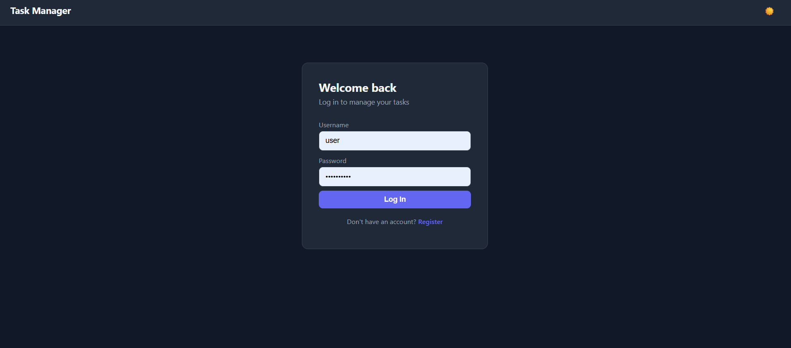
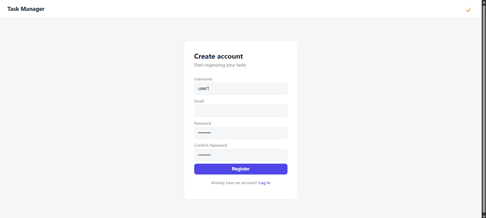
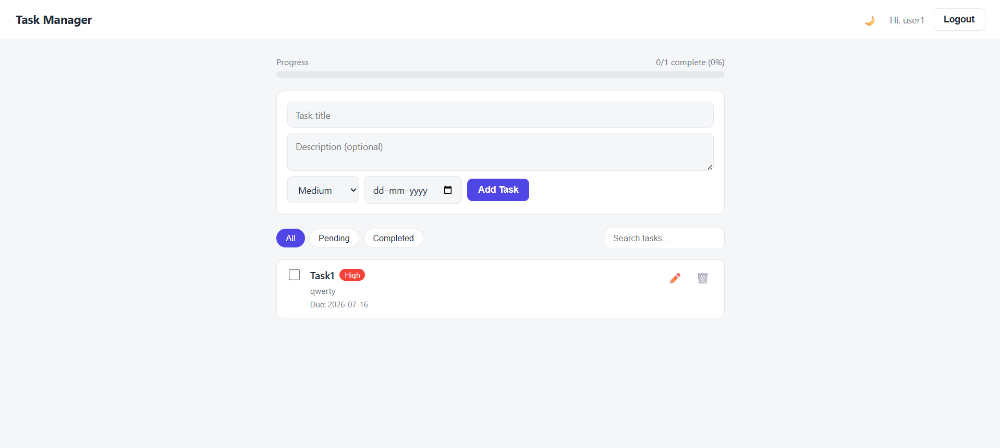
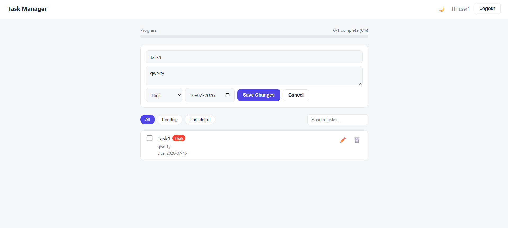
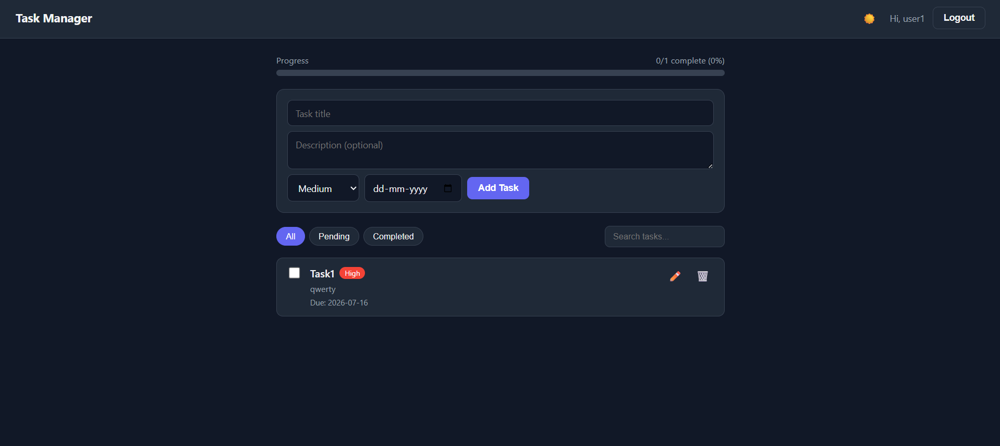

# Task Manager App

A simple Task Manager with a React frontend and a Django REST API backend. You can register, log in, and manage your own tasks (add, edit, delete, mark complete).

## What's Inside

- `backend/` — Django REST API
- `frontend/` — React application

Database is SQLite by default.

---

## Running the Backend

```powershell
cd backend
python -m venv venv
venv\Scripts\Activate.ps1
pip install -r requirements.txt
Copy-Item .env
python manage.py migrate
python manage.py runserver
```

Backend runs at `http://127.0.0.1:8000`.

---

## Running the Frontend

Open a new terminal:

```powershell
cd frontend
npm install
Copy-Item .env
npm start
```

Frontend runs at `http://localhost:3000`.

---

## Using the App

1. Open `http://localhost:3000`
2. Register a new account
3. Log in
4. Create tasks
5. Edit/Delete tasks
6. Mark tasks as completed
7. Search and filter tasks
8. Toggle Dark Mode

---

## API Endpoints

| Method | Endpoint | Description |
|---------|----------|-------------|
| POST | `/api/auth/register/` | Register |
| POST | `/api/auth/login/` | Login |
| GET/POST | `/api/tasks/` | List/Create Tasks |
| PUT/PATCH/DELETE | `/api/tasks/{id}/` | Update/Delete Task |
| GET | `/api/tasks/stats/` | Task Statistics |

---

## Features

- JWT Authentication
- CRUD Operations
- Task Search
- Task Filters
- Pagination
- Priority Levels
- Due Date
- Progress Bar
- Dark Mode
- Responsive UI

---

# Screenshots

## Login Page



## Register Page



## Dashboard



## Add Task



## Edit Task


## Dark Mode

